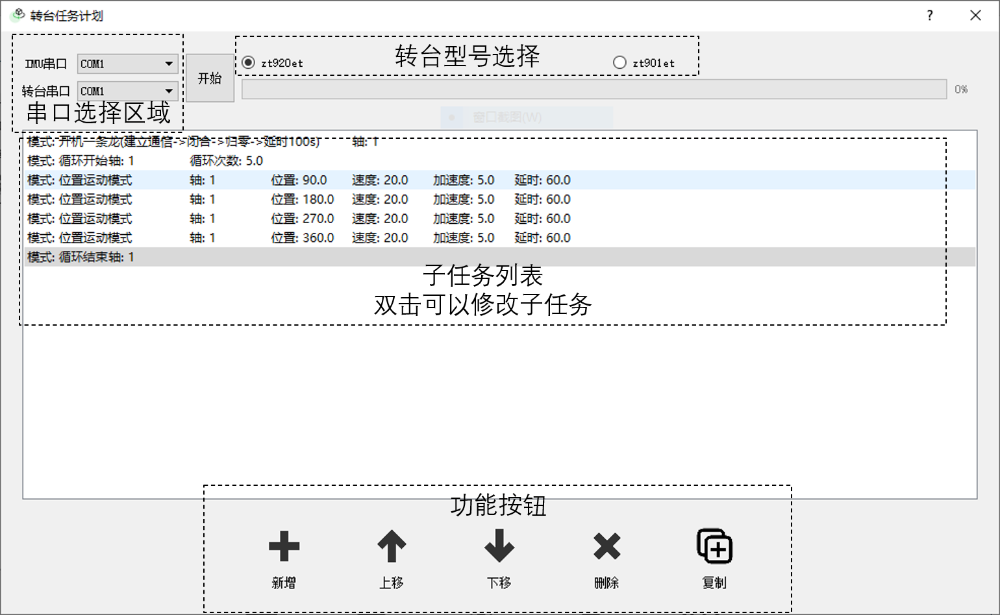

# 转台控制程序

## 安装

1. 下载并安装Miniconda3。<https://mirrors.tuna.tsinghua.edu.cn/anaconda/miniconda/Miniconda3-latest-Windows-x86_64.exe>

2. 安装成功后，下载解压转台控制程序<https://github.com/wqhot/ZNTKGUI/archive/v1.1.zip>

3. 打开*Anaconda Prompt*（可以在开始菜单中找到），切换目录到第2步解压后的路径，后执行:

```
conda env create -f envs.yaml
```


## 运行

1. 打开*Anaconda Prompt*（可以在开始菜单中找到），切换目录到转台控制程序所在的路径

2. 激活转台控制程序虚拟环境
```
conda activate ztcontrol
```
3. 开始运行，界面如下图所示

```
python ztUsage.py
```



4. 选择转台型号、串口号

5. 点击新增按钮，增加子任务

6. 任务设置完毕后，点击开始按钮即可开始任务

## 其他说明

1. 位置的单位是°； 速度的单位是°/s； 加速度的单位是°/s^2； 延时的单位是s； 幅度的单位是°， 频率的单位是Hz。

2. 延时功能是指子任务指令发送结束后等待的时间，而不是子任务指令发送之前等待的时间。并且延时并不保证准确。

3. 双击列表中的子任务项以对子任务进行修改。

4. 暂时不支持循环功能的嵌套，并且程序中没有对循环嵌套的检测，如果使用循环嵌套则会造成无法预知的任务规划结果。所以请保证循环不被其他循环嵌套。

5. 复制功能的快捷键是*Ctrl+C*，其他功能没有快捷键。
